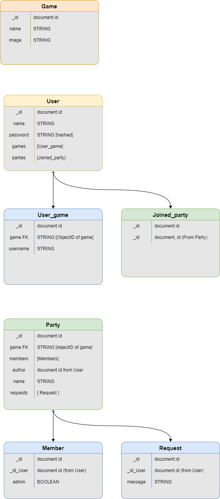

# Introduction

Are you a gamer? Feeling alone? Tired of solo queueing? Need help raiding? Don’t cry anymore! Your prayers have been answered. We introduce you to our web-based app targeting solo gamers looking for groups to party with and interact. 

LFG allows a user to create a party relating to the specific game the user is playing. The admin of the party has the privileges to accept any user who wants to join the party as well as assign other members to be co-admins. Non-admin users can join any party on any game as long as they’ve sent a ‘request to join’ to the admin and the admin approves it. Once a user becomes a member, they can interact with other people in the party through the party chat. Non-members are prohibited to interact with party members.

# Tech Stack
MERN stack
Socket.io
RAWG api (tbd)
Twitch api (tbd)
# Routes
# Installation
# User Stories
As a user, I want to be able to create a ‘Looking for Group’ posting online which will be searchable by other users connected.
As a user, I have the admin privileges for the party/group that I made.
As an admin, I can accept other user’s ‘request to join’
As an admin, I can assign other party members as co-admins
As an admin, I can kick toxic party members off the group.
As a user, I want to be able to search for groups.
As a user, I want to add and organize the games that I play.
As a user, I can view different parties on the specific game that I like.
As a user, I can request a ‘permission to join’ on different parties.
As a user, I can interact with party members through the party chat.

# EMD - Entity Model Diagram

# Wireframes
# MVP
User must be able to register a user account.
User must be able to edit his/her profile. This includes gamer profiles, user photo, etc.
User must be able to create a party for a specific game.
User can also search and join existing parties created by other users.
User must be able to edit party settings. The party creator can assign another party member as a co-owner of the party giving the member the privilege to edit party settings.
Party owners/authors must be able to screen party members before joining.
Party members can interact through the party chat.

# Stretch Goals
Add user chat functionality.
Search games from an API games database.
Require a password functionality before joining a party.

 ## URL Chart
| Path | Purpose |
| ------ | ---- |
|/register | Register page 
| /login | Login Page
| /logout| Logs out user and redirect to login page.
| /dashboard | manage users page update user info (change password, etc), Overview of user's most played games. 
| /games | view our top 10 games
| /games/browse | Query/Browse into game API
| /game/party | CRUD of active parties in game chosen. (toggle which component to show: CREATE a party, READ list of parties, EDIT party info, DELETE party etc.)

## Routing Chart (Server)
| Method | Path | Purpose |
| ------ | ---- | ------- |
| GET | /users | Gets all user information from database
| POST | /users/register | Adds a new user to the database
| POST | /users/login | Validates user’s credentials and logs the user in 
| PUT | /users/:id | Makes changes to values of certain key properties that a user can have (i.e., their name, password)
| DEL | /users/:id | Deletes a user from the database
| GET | /games | Gets all games and their information from database
| POST | /games | Adds a new game in the database
| POST | /games/:game_id/party | Posting a new listing for a clan/party.
| GET | /games/:game_id/party | Gets the list of active parties in a specific game.
| PUT | /games/:game_id/:party_id | Makes changes to information regarding an specific party.
| PUT | /games/:game_id/:party_id | Send a "join party request" (Edit the members sub-document inside the party schema.)
| DEL | /game/:game_id/:party_id | Deletes a specific party listing. 

